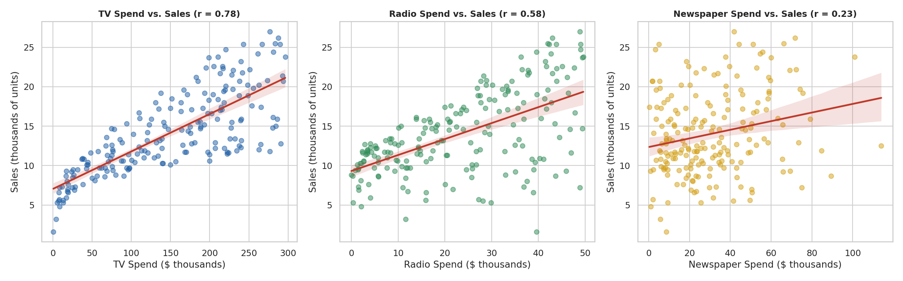
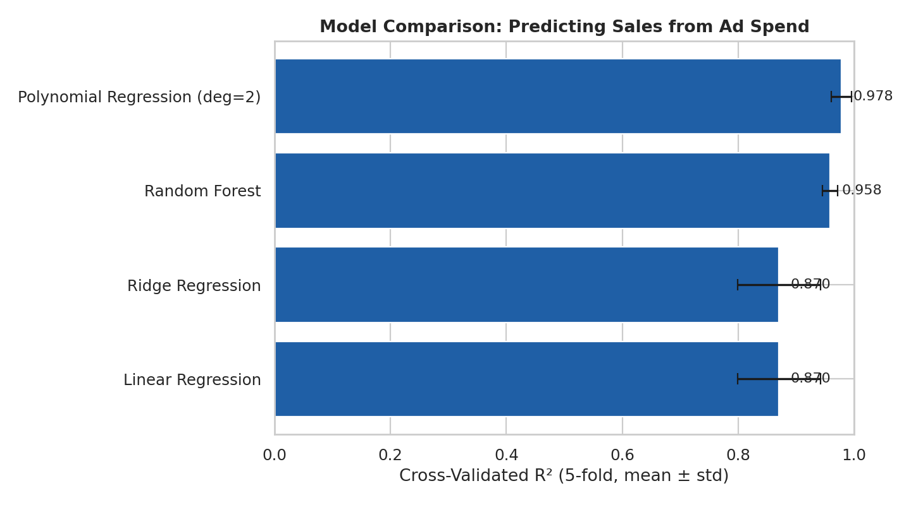
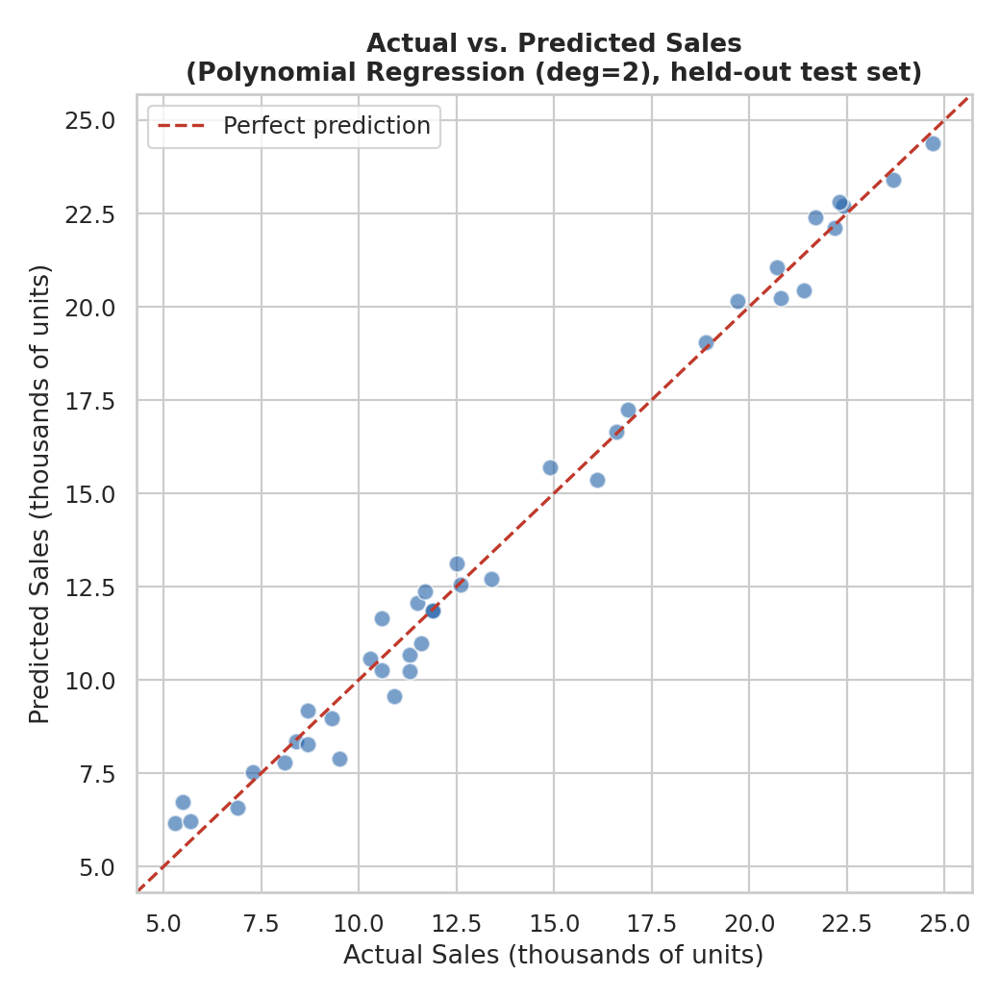
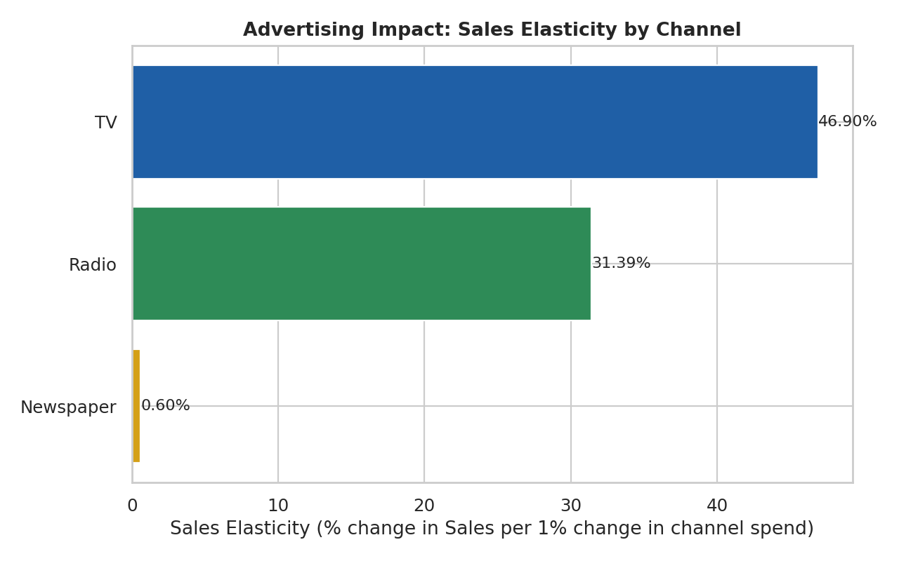

# Sales Prediction using Python

A data science project that predicts product sales from advertising spend across TV, Radio, and Newspaper channels — built with regression modeling, feature selection, and channel-level impact analysis to produce actionable marketing-budget recommendations.


---

## Project Overview

This project builds a sales-forecasting pipeline on the classic **Advertising dataset** (200 markets/products, each with TV, Radio, and Newspaper ad spend and resulting Sales). It answers:

1. How do TV, Radio, and Newspaper advertising spend relate to sales, individually and together?
2. Which regression/forecasting model predicts sales most accurately?
3. How much does a change in spend on each channel actually move sales (elasticity, marginal impact)?
4. What does this imply for how a marketing budget should be allocated?

**Headline finding:** TV and Radio spend together explain the large majority of variation in sales (simple correlations of 0.78 and 0.58 respectively), and a **degree-2 polynomial regression** — which captures diminishing returns and cross-channel synergy — predicts held-out sales with **R² = 0.987** (vs. 0.90 for plain linear regression). A budget-reallocation simulation shows shifting just 20% of the Newspaper budget into Radio, with total spend unchanged, is associated with an **+8.1% increase in predicted sales**.

📄 **[Read the full report (DOCX)](reports/Sales_Prediction_Report.docx)** · 📄 **[PDF version](reports/Sales_Prediction_Report.pdf)**

> **Note on scope:** the source dataset contains advertising spend per channel and resulting sales, but no explicit "target segment" or "platform" label beyond the three channels themselves (TV / Radio / Newspaper), and no date/time column. This project therefore treats **channel as the platform dimension**, uses **cross-sectional regression** rather than time-series forecasting (there is no time axis in the data), and flags this clearly as a data-availability limitation — see [Limitations](#limitations).

---

## Key Visualizations

<table>
<tr>
<td width="50%">

**Spend vs. Sales by channel**


</td>
<td width="50%">

**Model comparison**


</td>
</tr>
<tr>
<td width="50%">

**Actual vs. predicted sales (best model)**


</td>
<td width="50%">

**Sales elasticity by channel**


</td>
</tr>
</table>

More charts (distributions, correlation heatmap, pairplot, residual diagnostics, budget reallocation scenario) are in [`outputs/figures/`](outputs/figures/).

---

## Repository Structure

```
sales-prediction-python/
├── data/
│   ├── raw/                                  # Original, untouched source file
│   │   └── advertising.csv
│   └── processed/                             # Cleaned + feature-engineered data (generated)
│       └── advertising_clean.csv
├── src/                                       # Python analysis pipeline (run in order)
│   ├── 01_data_cleaning.py
│   ├── 02_eda_feature_selection.py
│   ├── 03_model_training.py
│   └── 04_advertising_impact_analysis.py
├── outputs/
│   ├── figures/                               # All generated chart PNGs (generated)
│   ├── tables/                                # Model metrics, coefficients, elasticity, scenario (generated)
│   └── models/                                # Saved fitted models (.pkl) (generated)
├── reports/
│   ├── Sales_Prediction_Report.docx
│   └── Sales_Prediction_Report.pdf
├── requirements.txt
├── LICENSE
└── README.md
```

> Files marked **(generated)** are produced by running the scripts in `src/` — see [Reproducing the Analysis](#reproducing-the-analysis). They are already included in this repo so the project can be reviewed without running any code.

---

## Dataset

| File | Rows | Columns | Notes |
|---|---|---|---|
| `advertising.csv` | 200 | TV, Radio, Newspaper, Sales | Ad spend in $ thousands; Sales in thousands of units |

**Source:** the classic "Advertising" dataset (Kaggle / ISLR), used widely as a benchmark for marketing-mix regression problems.

### Cleaning & feature engineering performed

- Dropped the unnamed leading index column from the raw CSV
- Checked and confirmed no missing values, no duplicate rows, no negative spend/sales values
- Engineered `total_spend` (sum of all three channels)
- Engineered `tv_share`, `radio_share`, `newspaper_share` (each channel's share of total spend — the closest available proxy for a "platform mix" feature, since no explicit platform/segment label exists in the source data)
- Engineered pairwise interaction terms (`tv_radio_interaction`, `tv_newspaper_interaction`, `radio_newspaper_interaction`) to capture potential cross-channel synergy
- Engineered `sales_per_spend` as a simple spend-efficiency proxy

Full logic: [`src/01_data_cleaning.py`](src/01_data_cleaning.py).

### Feature selection

- Correlation with Sales: **TV r=0.78**, **Radio r=0.58**, **Newspaper r=0.23** — all three retained as model inputs since each carries an independent, non-trivial signal
- **Variance Inflation Factor (VIF)** check confirmed low multicollinearity between channels (TV: 1.00, Radio: 1.14, Newspaper: 1.15 — all well under the common VIF<5 threshold), so all three channels were safely included together without distorting regression coefficients

Full logic: [`src/02_eda_feature_selection.py`](src/02_eda_feature_selection.py).

---

## Modeling Approach & Results

Four models were trained on an 80/20 train/test split and compared with 5-fold cross-validation:

| Model | Test R² | Test RMSE | Test MAE | CV R² (mean ± std) |
|---|---|---|---|---|
| **Polynomial Regression (degree 2)** | **0.987** | **0.643** | **0.526** | **0.978 ± 0.017** |
| Random Forest (300 trees, depth 5) | 0.977 | 0.858 | 0.682 | 0.958 ± 0.013 |
| Ridge Regression | 0.899 | 1.782 | 1.461 | 0.870 ± 0.072 |
| Linear Regression | 0.899 | 1.782 | 1.461 | 0.870 ± 0.072 |

**Polynomial Regression (degree 2) was selected as the best model** — it captures diminishing returns and cross-channel synergy that a plain linear model misses, and it generalizes consistently across folds (lowest CV variance among the top performers). The fitted model is saved at [`outputs/models/best_model.pkl`](outputs/models/best_model.pkl).

For interpretability, the **Linear Regression coefficients** were kept and used directly for the impact/elasticity analysis below, since polynomial/forest coefficients don't translate into simple "$ in → units out" statements:

```
Sales ≈ 2.98 + 0.045 × TV + 0.189 × Radio + 0.003 × Newspaper
```
(TV and Radio spend in $ thousands; Sales in thousands of units)

Full logic: [`src/03_model_training.py`](src/03_model_training.py).

---

## Advertising Impact Analysis

**Sales elasticity** (% change in sales per 1% change in a channel's spend, evaluated at average spend levels):

| Channel | Coefficient | Avg. Spend ($k) | Elasticity |
|---|---|---|---|
| TV | 0.045 | 147.0 | **46.9%** |
| Radio | 0.189 | 23.3 | **31.4%** |
| Newspaper | 0.003 | 30.6 | **0.6%** |

- **TV has the largest total elasticity** mainly because it commands the largest share of the budget — every dollar matters in aggregate even though its per-dollar coefficient is smaller than Radio's.
- **Radio is the most efficient channel per dollar spent** (coefficient 0.189 vs. TV's 0.045) despite getting roughly 1/6th of TV's budget — it is doing more with less.
- **Newspaper has almost no measurable relationship with sales** once TV and Radio are accounted for (coefficient ≈ 0, elasticity 0.6%).

**Budget reallocation scenario:** shifting 20% of the average Newspaper budget (≈$6.1k) into Radio, holding total spend fixed:

| Scenario | TV ($k) | Radio ($k) | Newspaper ($k) | Predicted Sales | Change |
|---|---|---|---|---|---|
| Current average allocation | 147.0 | 23.3 | 30.6 | 14.04 | — |
| Shift 20% of Newspaper → Radio | 147.0 | 29.4 | 24.4 | 15.18 | **+8.1%** |

Full logic: [`src/04_advertising_impact_analysis.py`](src/04_advertising_impact_analysis.py).

---

## Business Recommendations

1. **Shift incremental budget from Newspaper to Radio.** Newspaper spend shows essentially no independent relationship with sales in this data; Radio shows the strongest per-dollar effect. Even a modest 20% reallocation is associated with a meaningful (~8%) sales lift in the model.
2. **Protect and grow the TV budget, but expect diminishing returns at the margin.** TV remains the single largest driver of total sales impact (highest elasticity) simply due to scale of spend; the polynomial model winning over the linear model suggests returns to TV spend are not perfectly linear, so very large further increases should be tested incrementally rather than assumed to scale 1:1.
3. **Use Radio as the "efficiency lever" in budget planning.** Per dollar, Radio outperforms both other channels — it is the best candidate for incremental test budget when looking to grow sales without growing total spend.
4. **Treat Newspaper spend as a candidate for budget cuts or a different objective.** If Newspaper spend serves a goal other than direct sales lift (e.g., brand presence, local reach), that goal should be measured separately — this data does not support it as a sales driver.
5. **Validate the polynomial model's synergy effects with a controlled test** (e.g., a regional budget A/B test) before committing large budget shifts — observational regression on 200 rows is a strong signal, not proof of causation.

Full discussion: [`reports/Sales_Prediction_Report.docx`](reports/Sales_Prediction_Report.docx), Section 7.

---

## Reproducing the Analysis

### Requirements
- Python 3.10+
- See [`requirements.txt`](requirements.txt) (pandas, numpy, matplotlib, seaborn, scikit-learn, statsmodels, joblib)

### Setup
```bash
git clone https://github.com/<your-username>/sales-prediction-python.git
cd sales-prediction-python
python -m venv venv
source venv/bin/activate   # Windows: venv\Scripts\activate
pip install -r requirements.txt
```

### Run the pipeline
Scripts are numbered and must be run in order from the project root — each stage depends on the output of the previous one:

```bash
python src/01_data_cleaning.py                  # raw CSV -> cleaned + feature-engineered data
python src/02_eda_feature_selection.py           # distributions, correlations, VIF check
python src/03_model_training.py                  # trains & compares 4 models, saves the best one
python src/04_advertising_impact_analysis.py      # elasticity + budget reallocation scenario
```

All charts are written to `outputs/figures/`, summary tables to `outputs/tables/`, and fitted models to `outputs/models/` — overwriting the versions already committed to this repo.

---

## Limitations

- **No explicit "target segment" or "platform" feature in the source data** beyond the three ad channels — channel was used as the platform dimension throughout, and channel-spend share was engineered as the closest available proxy for audience/platform mix. A richer dataset with actual segment or platform-level identifiers would allow a more granular analysis.
- **No time dimension.** Each row is a market/product snapshot, not a time series — there is no date column to model trend or seasonality, so this project uses cross-sectional regression rather than a time-series forecasting model (e.g., ARIMA), which would require sequential time-stamped data.
- **Small sample size (200 rows).** Sufficient for the regression methods used here, but elasticity and scenario estimates should be treated as directional, not precise, and re-validated as more data becomes available.
- **Correlation vs. causation.** The model is observational; the budget-reallocation scenario is a model-based simulation, not a causal experiment. Real-world budget shifts should be tested incrementally (e.g., regional holdout tests) before being rolled out fully.
- **Extrapolation risk.** Predictions are most reliable within the observed spend ranges (TV: $0.7k–$296k, Radio: $0–$49.6k, Newspaper: $0.3k–$114k); recommendations assume changes within or near this range.

---

## License

Code in this repository is released under the [MIT License](LICENSE). The underlying advertising dataset is a widely-used public benchmark dataset; no proprietary or restricted data is included.
